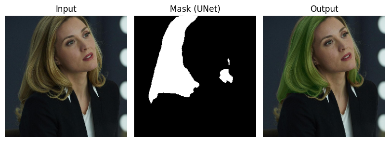
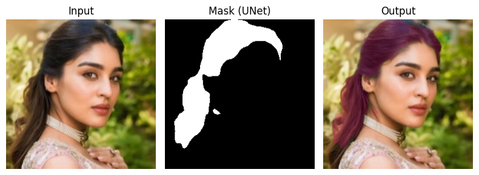

# Virtual Hair Colour Try-On System for Hair Makeovers

## Overview
The Virtual Hair Colour Try-On System for Hair Makeovers is a deep learning-based application that allows users to experiment with different hair colors on their photos. By leveraging a __U-Net__ architecture for __image segmentation__, this system precisely isolates the hair region and applies various hair colors, enabling a realistic makeover effect.

[Dataset](https://www.kaggle.com/datasets/mirfan899/hairmasks) 

[hair_model.pth](https://github.com/playatanu/hair-color-try-on/releases/download/weight/hair_model.pth)

## Example Images

